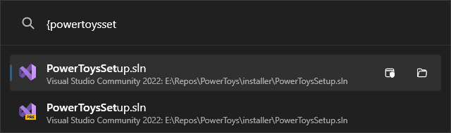

# PowerToys Run: Visual Studio plugin

Simple [PowerToys Run](https://learn.microsoft.com/windows/powertoys/run) experimental plugin for search Visual Studio recents.

## Important

- Support Visual Studio 2022 stable and preview (not tested with previous versions)
- The plugin may stop working in case of changes to Visual Studio since is built on top of the `vswhere.exe` and `%LOCALAPPDATA%\Microsoft\VisualStudio\...\ApplicationPrivateSettings.xml` 
  - It gets installed instances of Visual Studio using `vswhere.exe`
  - Then gets recents from the `CodeContainers.Offline` section of the `ApplicationPrivateSettings.xml` file of the instance

## Requirements

- Visual Studio 2022
- PowerToys minimum version 0.76.0

## Installation

- Download the [latest release](https://github.com/davidegiacometti/PowerToys-Run-VisualStudio/releases/) by selecting the architecture that matches your machine: `x64` (more common) or `ARM64`
- Close PowerToys
- Extract the archive to `%LOCALAPPDATA%\Microsoft\PowerToys\PowerToys Run\Plugins`
- Open PowerToys

## Localization
The plugin has limited user-facing strings, but due to feedback and downloads, version 0.4.0 and onward supports localization.  
The goal is to cover the same languages as PowerToys.  
Pull requests for new languages or improvements to existing translations are welcome.
- Fork and clone this repository
- Open `Community.PowerToys.Run.Plugin.VisualStudio.sln` in Visual Studio
- In Solution Explorer, navigate to `Community.PowerToys.Run.Plugin.VisualStudio\Properties`
- To enhance existing translations, open and update the relevant `.resx` file
- To add a new language, create a new resource file named `Resources.xx-XX.resx` (e.g. `Resources.it-IT.resx` for Italian)
- Once you're done, commit your changes, push to GitHub, and make a pull request

## Screenshots

